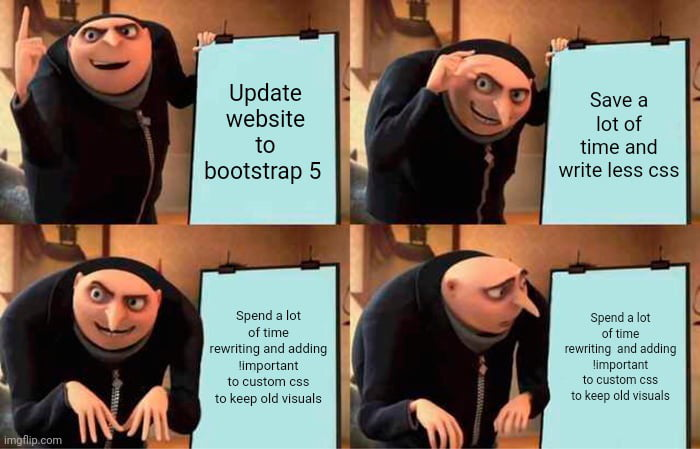

  

## Bootstrap vs CSS
Learning a UI framework like Bootstrap 5 has been a headache, the syntax is unfamiliar, the utility classes seem endless, and the documentation is extremely overwhelming. I find it hard to believe why anyone would bother investing the time and frustration into learning a framework when raw HTML and CSS seem perfectly capable of getting the job done. But, as web applications scale from simple web pages into complex software, the limitations of raw, unstyled markup become obvious. The primary issue with relying solely on custom CSS is scalability. While writing raw CSS gives a developer total control over a single, static page, it quickly devolves into a fragile, tangled mess of conflicting rules and media queries as the project expands. This "spaghetti CSS" is notoriously difficult to maintain and a single tweak to a parent container can unintentionally shatter the layout on an entirely different page or device, turning updates into unpredictable debugging sessions.

## But why?
This is where bootstrap comes in. In web development, the primary focus is to build maintainable, standardized, and scalable systems rather than just mashing code together. UI frameworks provide a critical, standardized architecture for the frontend and instead of every developer on a team writing bespoke, isolated CSS for a button or a navigation bar, a framework like Bootstrap 5 offers a shared, universal vocabulary. Using classes to ensure that the application remains cohesive and professional, regardless of who specifically wrote the code. The built-in column system throws away the need of complex math required for cross-device compatibility, allowing developers to focus on the application's core functionality rather than endlessly fighting browser quirks.

## Reflectio
My own experience with Bootstrap 5 has been frustrating as I'm still struggling with the framework and trying my best to learn its intricacies. Trying to memorize an entirely new vocabulary of utility classes—like remembering exactly when to use d-flex justify-content-center mt-3—often feels clunky and overwhelming compared to writing a few lines of traditional CSS. However, even in the midst of that struggle, I can clearly see the value, my frustration is offset by the realization that I no longer have to constantly fight browser quirks or write complex CSS just to make a simple navigation bar collapse properly on a mobile screen. Learning Bootstrap 5 has helped me turn frontend design from an unpredictable, pixel-pushing chore into a reliable design tool. The process is still challenging, and I am definitely still on that learning curve, but the result to ensure that the software we build is resilient across the modern web makes the effort somewhat worthwhile.