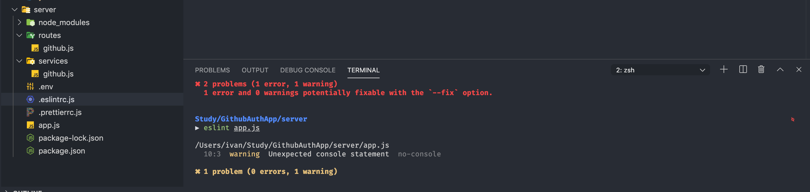

<div align="center">
  
</div>

## Introduction

When I first started coding, I viewed "coding standards" as an equivalent of a teacher obsessing over essay formats. To a student just trying to get a function to return the right value for a lab, arguing over whether a curly brace belongs on line 4 or line 5 feels like an overreaction. We have exams to study for and algorithms to implement; who cares about "indentation consistency" as long as the code compiles and runs. During a week of integrating ESLint into my workflow for my ICS coursework, my perspective has slightly shifted. I’ve realized that coding standards aren't just about aesthetics but functions as a feedback loop that catches "silent failures" such as accidental global variables or unhandled promises before they turn into frustrating debugging sessions.

## Restrictions


Many students, including myself view a ESLint more like a spell-checker, but it is actually more like a structural engineer. In a language as "permissive" as JavaScript, it is very easy to write code that runs but is fundamentally broken. For example by mandating specific patterns, these standards act as an automated gatekeeper that blocks "anti-patterns" like ```eval()``` usage or floating promises, effectively embedding decades of industry hard-knocks directly into my editor. Instead of discovering a memory leak or a scope collision during a demo, I am forced to resolve the root cause while the code is still fresh in my mind. It’s the difference between learning from a textbook and having a compiler that refuses to let you be lazy.

To reiterate, some students find ESLint tedious due to the nature of it's strict standards that can stifle "creativity" and to that I wholeheartedly agree, but I’ve seen the the other perspective. By automating the trivial decisions such as how to format a nested object or where to break a long line I free up time to solve the actual problem-solving. In software development where the logic is already dense, the last thing I want to do is waste my time deciphering my own or other's messy, inconsistent syntax from a previous session. When the structure is standardized, the code becomes scannable, allowing the other developers to spot logic errors rather than getting distracted by missing semicolons.


## Walking into a crime scene

I’ll admit, the first few days were overwhelming, I have never seen VSCode looked this bad, covered in numerous red and yellow warnings. But by the end of the week, getting rid of those errors wasn't a chore anymore; it became more of a quality control check. Instead of just throwing code at the wall to see what sticks, I’m now forced to handle things like unused variables, unintended global scopes, and missing return statements as I go. The "pain" of ESLint is really just the friction of breaking my sloppy habits—like leaving console.log clutter everywhere or using ```==``` when I should be using ```===```. It’s the process of shifting from just "getting it to work" to writing code that another developer can actually read, trust, and work with.