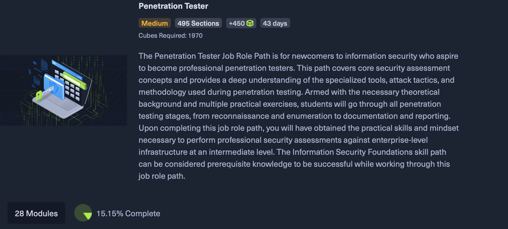

## CPTS Overview

The Certified Penetration Testing Specialist (CPTS) is a technical certification offered by Hack The Box that focuses on the modern methodology of ethical hacking. Unlike many entry-level exams that rely on multiple choice questions, the CPTS is a fully hands-on ten-day practical exam. The exam covers a wide range of skills including web application attacks, vulnerability assessment, and complex Active Directory exploitation. Since it demands a high-quality, professional penetration testing report to pass, it is widely respected as a true measure of an individual's readiness for a real-world security role, though it isn't as commonly recognized as certifications like those from CompTIA

## Why?
I have decided to take on the CPTS as one of my personal projects because I wanted to see if I could actually apply what I have been learning in my security courses, my practice with CTFs, and my own self-directed study to a real-world scenario. I have always been drawn to the analytical side of security, and the CPTS feels like the perfect way to test that. The certification is not just about running tools. Instead, it is about the persistence and the deep dive enumeration required to understand a system even better than the person who built it. Beyond technical challenge, this project is to prove to myself that I can handle the pressure of a professional grade assessment. I have already spent time building my own Python scripts to clean up Nmap data for CTFs, and I realized that I want to take that mindset to the next level. The CPTS is notoriously known to be rigorous, especially with its focus on Active Directory and detailed reporting, which is exactly the kind of hands on experience I am looking for.

Source: <a href="https://github.com/hansbeur/Pentesting-Notes.git">CPTS Notes(WIP)</a>

More Info on <a href="https://academy.hackthebox.com/preview/certifications/htb-certified-penetration-testing-specialist">CPTS</a>