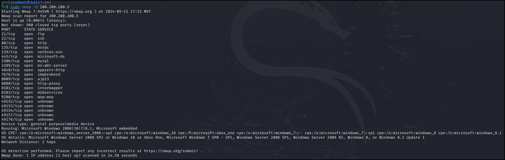

<!--  -->
<!--  -->


## Why 
During CTFs, enumeration is almost always the majority of the challenge and often makes up about 90% of the work, because every "*exploit*" depends on understanding what services are running, how they are exposed, and how they connect to each other. I personally dislike reading through the raw Nmap output as it's very text heavy, especially when scanning multiple hosts or re-running scans after gaining new access. This script aims to simplify the output of Nmap. It takes the scan results and reorganizes them into a clean, readable, host-focused summary that shows what is online, what ports are open, and what might be exploitable.

Rather than replacing Nmap and creating a standalone port scanner that could compete with it's usefulness (*Requires deep knowledge of TCP/IP tack*), the script builds on it while removing some of the awkwardness that shows up in time-limited environments like CTFs or just save time in general. By clearly listing open ports along with their services and version information, and then calling out common high-value services used for lateral movement, it speeds up decision-making. The output naturally points the user toward the next step, such as web exploitation, SMB enumeration, or RDP attacks, without requiring them to mentally translate port numbers into attack paths.


**Here is a snippet of organizing the data:**

```
def analyze_results(nm):

    # Iterate over all hosts found
    for host in nm.all_hosts():
        print(f"***********************************************")
        print(f"Host: {host} ({nm[host].hostname()})")
        print(f"State: {nm[host].state()}")
        
        # for loop to check all the ports whether TCP or UDP
        for proto in nm[host].all_protocols():
            print(f"\nProtocol: {proto.upper()}")
            
            # sort the found ports 
            lport = nm[host][proto].keys()
            
            for port in sorted(lport):
                state = nm[host][proto][port]['state']
                product = nm[host][proto][port]['product']
                version = nm[host][proto][port]['version']
              
                service_info = f"{product} {version}".strip()
                print(f"  Port: {port:<5} | State: {state:<6} | Service: {service_info}")

                # list the usual suspects for vulenrabilites
                if port == 80 or port == 443:
                    print(f"    [!] Web Server detected - Check for HTTP/HTTPS vulnerabilities.")
                elif port == 445:
                    print(f"    [!] SMB detected - Check for EternalBlue or NULL Session.")
                elif port == 3389:
                    print(f"    [!] RDP detected - Check for BlueKeep or Default Creds.")
        
        print(f"***********************************************")
```  

## Future Improvements

While the script aims to simplify the results of a network scan, future updates will focus on making the start of the process just as easy. A major goal is to build a visual menu right in the terminal. Instead of manually typing complicated arguments, the script would present a simple graphic interface offering three clear presets: "Stealth" to avoid detection, "Noisy" for maximum speed, or "Default" for a standard check. This feature would allow me to instantly select an option, without needing to type out the specific commands or flags required for each method.


