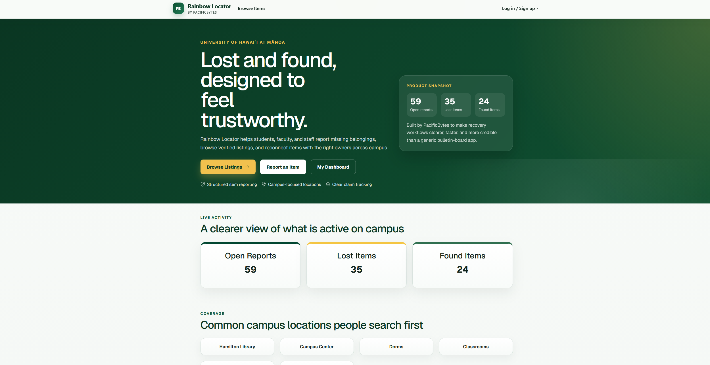
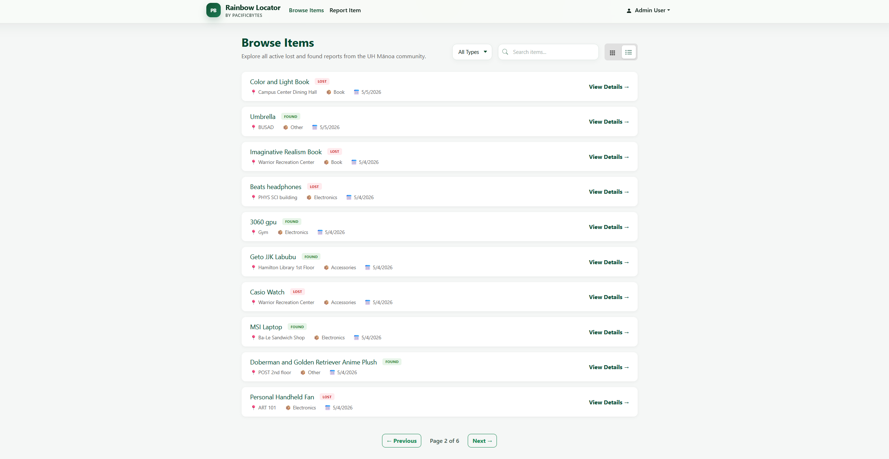
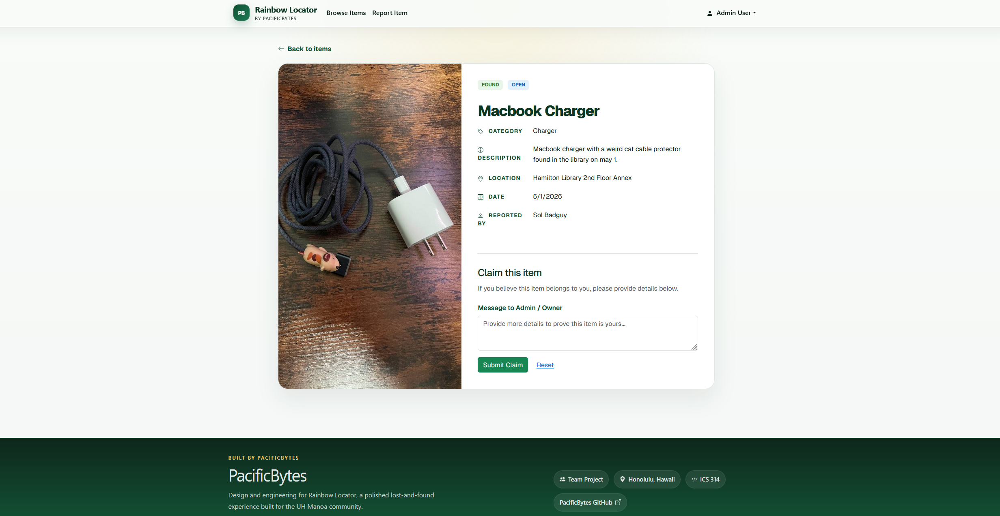

# Project: Rainbow Locator

## Overview

Rainbow Locator is a centralized Lost and Found web application designed specifically for the University of Hawaiʻi at Mānoa community. The application aims to streamline the process of reporting lost items and reuniting them with their owners. It provides a user-friendly interface for both students and staff to post details about items they've lost or found, search through a database of reported items, and securely claim items through a verified process.

## Contributions

As a key developer on this project, my contributions included:

- **Full-Stack Development:** Architected and implemented core features using Next.js, including the reporting system and item browsing.
- **Database Design:** Built upopn the given data model of Prisma and PostgreSQL to handle users, lost/found items, and the claim verification process.
- **Authentication & Security:** Integrated NextAuth.js to provide secure user authentication and implemented role-based access control (RBAC) to distinguish between regular users and administrative staff.
- **UI/UX Implementation:** Designed and developed responsive frontend components using React to ensure a seamless experience across devices.

## Lessons Learned

Working on Rainbow Locator was a significant learning experience that provided several key takeaways:

- **Full-Stack Integration:** Deepened my understanding of how to synchronize a modern frontend framework, Next.js, with a powerful ORM, Prisma, and a relational database.
- **State Management & Authentication:** Gained practical experience in managing application state and handling complex authentication flows in a server-side rendered environment.
- **Base64 Image Handling:** Implemented a secure server-side utility to convert uploaded item images into **Base64 data URIs**. Allowing for direct storage within the database, eliminating the need for external file storage solutions and simplifying the deployment architecture.
- **User-Centric Design:** Learned the importance of designing for specific community needs, focusing on ease of use and clarity in the reporting process.
- **Agile Development:** Improved my skills in iterative development, testing using Playwright, and maintaining a clean, well-documented codebase.

## Screenshots

*Rainbow Locator Landing Page*

*Browsing reported lost and found items.*

## Repositories
[Learn More](https://pacificbytes.github.io/)
[Rainbow Locator GitHub Organization Page](https://github.com/pacificbytes)
[Rainbow Locator Source Code](https://github.com/pacificbytes/rainbow-locator)
