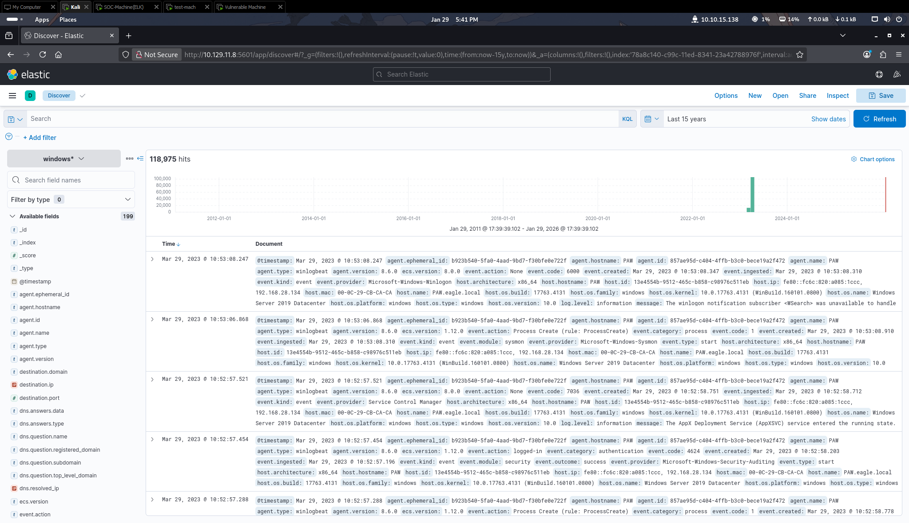
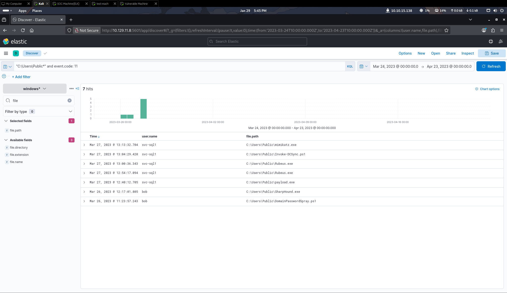
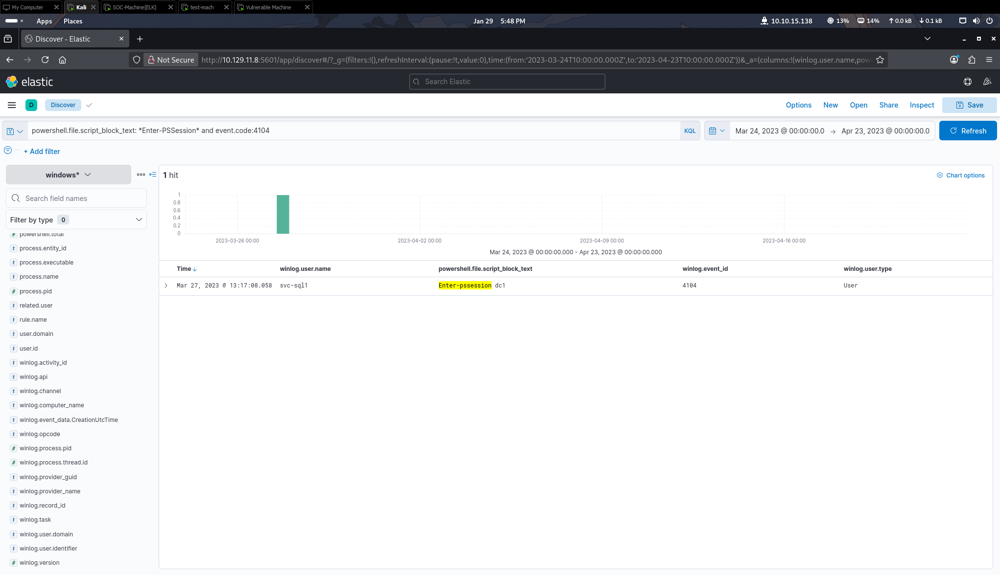

---


As I work towards my Security Science Degree, I wanted immediate hands on exprience of cybersecurity. For that, I built a virtual Security Operations Center (SOC) to learn how defenders find and stop hackers. This project helped me move past just reading about attacks. Instead, I built a real system that can collect and show security data as it happens. For this project, I set up several virtual computers on my own machine. I used a Kali Linux computer as the "Attacker" and a Windows 7 computer as the "Victim." Every move the attacker made such as running a malicious file, was sent to a central system called a SIEM. This system lets me see exactly how an attack looks to a junior defender.


```
Barebones Lab due to limited hardware
SOC-Machine: Ubuntu LTS Server
Vulnerable Machine: Windows 7 (Stuxbot Vulnerable)
```

## Home Page


## Lateral Transfer Tool Detection


*This query monitors Sysmon Event ID 11 to detect file creation events within the C:\Users\Public directory, a very common "staged" location to use.
We find an application called <a href ="https://jumpcloud.com/it-index/what-is-rubeus">Rubeus</a> known for lateral movement and privelage escalation.*



*This query monitors PowerShell Event ID 4104 (Remote Command Execution) to detect the use of the Enter-PSSession command, which indicates an adversary is attempting Lateral Movement to remotely control another machine on the network.*

## Next Steps
As the images show, my current setup is designed to detect old common vulnerabilities. I plan to continuously improve this lab so it can identify modern threats and more complex attack patterns. My goal is to move beyond simple "signature-based" detection, where the system looks for a specific file name and move toward "behavior-based" detection, where the system looks for suspicious actions. To achieve this, I will try and experiment with Sigma rules, which are a universal language used by security teams to share descriptions of how attacks look in logs and research more on "Living off the Land" techniques.